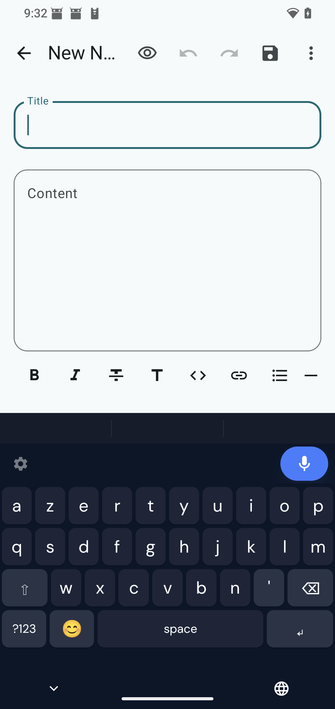
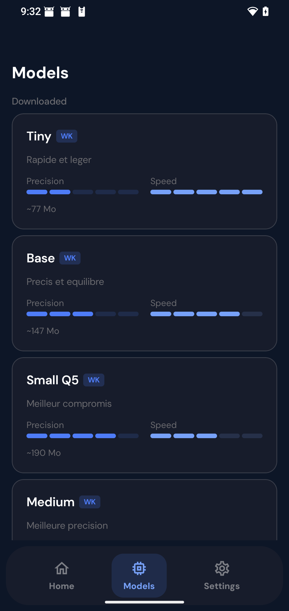
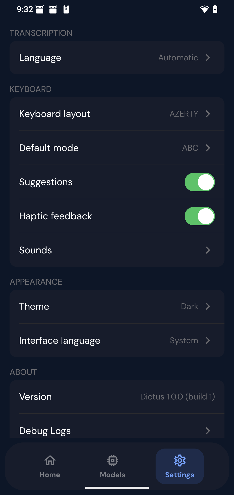

  

<h1 align="center">Dictus for Android</h1>

  <strong>Free, open-source Android keyboard for voice dictation — 100% on-device.</strong> 
  Speak in any app. No cloud, no account, no subscription.

  
  
  
  
  

  <a href="https://getdictus.com">Website</a> ·
  <a href="https://github.com/getdictus/dictus-android/releases/latest">Download APK</a> ·
  <a href="https://github.com/getdictus/dictus-ios">iOS</a> ·
  <a href="https://github.com/getdictus/dictus-desktop">Desktop</a> ·
  <a href="https://t.me/getdictus">Community</a>

---

Dictus is a free, open-source Android keyboard that adds voice dictation to any app. All speech recognition runs **on-device** via Whisper (whisper.cpp) and NVIDIA Parakeet (sherpa-onnx) — no server, no account, no subscription.

## Why Dictus?

- 🔒 **100% on-device** — your voice never leaves your phone. No cloud, no telemetry, no account.
- 🆓 **Free & open source** — MIT licensed, no subscription, fully auditable code.
- ⌨️ **System-wide IME** — works in every app as your default keyboard.
- ⚡ **Multi-engine** — Whisper (multilingual) or Parakeet (English, fast).
- 🌐 **FR + EN dictionaries** — smart word predictions while typing.

## How Dictus compares

| Feature | **Dictus** | Wispr Flow | Gboard Voice | SuperWhisper |
| --- | :---: | :---: | :---: | :---: |
| Price | **Free** | Free / $15/mo | Free | Free / $8.49/mo |
| 100% offline | ✅ | ❌ | ⚠️ | ⚠️ |
| Privacy-first | ✅ | ❌ | ⚠️ | ⚠️ |
| Open source | ✅ | ❌ | ❌ | ❌ |
| System keyboard | ✅ | ❌ | ✅ | ❌ |
| Cross-platform | ✅ ([iOS](https://github.com/getdictus/dictus-ios) · [Android](https://github.com/getdictus/dictus-android) · [Desktop](https://github.com/getdictus/dictus-desktop)) | iOS · macOS · Win · Android | Android · Wear OS | iOS · macOS · Win |

See the full comparison on [getdictus.com](https://getdictus.com).

## Install the beta

Dictus is currently in public beta — install by sideloading the APK from [GitHub Releases](https://github.com/getdictus/dictus-android/releases/latest).

1. On your Android device, go to **Settings → Apps → Special app access → Install unknown apps** and allow your browser.
2. Download the latest APK from [Releases](https://github.com/getdictus/dictus-android/releases/latest).
3. Open the `.apk` and tap **Install**.
4. Go to **Settings → System → Languages & input → On-screen keyboard → Manage on-screen keyboards**.
5. Enable **Dictus**.
6. Open any text field, tap the keyboard icon in the navigation bar, and select **Dictus**.

**Requirements:** Android 10 (API 29) or higher · ~150 MB for the smallest Whisper model.

## Screenshots

| Keyboard | Model Manager | Settings |
|----------|---------------|----------|
|  |  |  |

## Features

- **Offline voice dictation** — Whisper + NVIDIA Parakeet, entirely on-device
- **Multi-engine STT** — Whisper (multilingual) or Parakeet (English, fast)
- **Smart suggestions** — word predictions from FR+EN dictionaries while typing
- **Personal dictionary** — learns your frequently typed words
- **System keyboard** — works in any app as your default IME
- **AZERTY & QWERTY** — switchable keyboard layouts

## Roadmap

- [x] On-device Whisper + Parakeet engines
- [x] System IME with AZERTY / QWERTY layouts
- [x] FR + EN word predictions and personal dictionary
- [ ] Smart Mode Pro — on-device LLM reformulation
- [ ] Custom vocabulary (technical terms, names)
- [ ] Searchable local transcription history
- [ ] Audio-file transcription
- [ ] Sync settings across Dictus iOS / Android / Desktop (offline-first)

Have an idea? Open a [feature request](https://github.com/getdictus/dictus-android/issues/new) — we prioritize the most-upvoted ones.

## Tech stack

- Kotlin + Jetpack Compose
- [whisper.cpp](https://github.com/ggerganov/whisper.cpp) (MIT) — Whisper STT
- [sherpa-onnx](https://github.com/k2-fsa/sherpa-onnx) (Apache 2.0) — Parakeet STT
- Material Design 3

## Contributing

Contributions are welcome — see [CONTRIBUTING.md](CONTRIBUTING.md) for build setup, module overview, and PR guidelines. Good entry points:

- `good first issue` and `help wanted` in [Issues](https://github.com/getdictus/dictus-android/issues)
- Bug reports with logs from a recent build
- Translations & locale tuning

## Privacy

Dictus collects no user data. All speech processing happens on your device. See our [Privacy Policy](https://www.getdictus.com/en/privacy).

## Support the project

Dictus is free and will stay free. If it helps you every day, consider [supporting development](https://getdictus.com/donate) — it directly funds new features and platform support.

## Community

- 🌐 [getdictus.com](https://getdictus.com)
- 💬 [Telegram](https://t.me/getdictus)
- 🐛 [Issues](https://github.com/getdictus/dictus-android/issues)
- 📧 [hello@getdictus.com](mailto:hello@getdictus.com)

## License

MIT — see [LICENSE](LICENSE).

---

  Made with ❤️ by <a href="https://pivi.solutions">PIVI Solutions</a> · <a href="https://github.com/getdictus">@getdictus</a>

